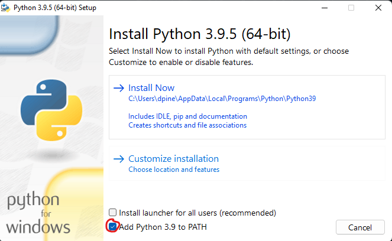
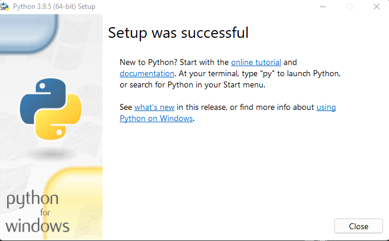
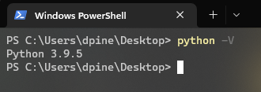
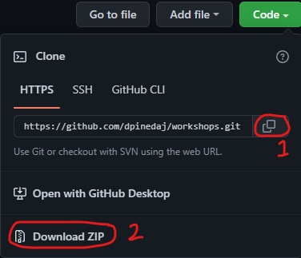

# Basig Data Engineering Task

This workshop consist in a simulation of data pipeline orchestrated by a postgres database.

The implementation consists in just three steps.
- The creation of fake data in csv files, the logic is stored in [file_maker](https://github.com/dpinedaj/workshops/blob/master/basic_dataeng_tasks/scripts/file_maker.py)
- The publishing of the tasks needed to perform, the logic is stored in [publisher](https://github.com/dpinedaj/workshops/blob/master/basic_dataeng_tasks/scripts/publisher.py)
- The worker that perform the task that basically is moving the file from one folder to another, the logic is stored in [worker](https://github.com/dpinedaj/workshops/blob/master/basic_dataeng_tasks/scripts/worker.py)

## Project Setup

### Python Installation
#### Windows setup
- Download python from https://www.python.org/, is recommended to use one of the most stable versions (3.7.3, 3.8.10, 3.9.5), for this project I suggest 3.9.5 click [here](https://www.python.org/ftp/python/3.9.5/python-3.9.5-amd64.exe) to download.
- Execute the .exe file

    
- Check `Add Python 3.9 to PATH` and then click `Install Now`
- When the installation finishes successfully you should see the following screen: 

    
- open a powershell window pressing `Shift + right click` in any folder or the raw desktop.

    
- If you write `python -V` in the shell, you should see the following output:

    
- Install pipenv that is needed to create virtual environments, more information [here](https://pipenv.pypa.io/en/latest/) writting `pip install pipenv` in the shell.
### Project Setup
- Download the repository using git or as a zip file as follows:
    - Alternative 1: git: if you are familiar with git, just copy the https path here and in powershell run `git clone https://github.com/dpinedaj/workshops.git` you can read more about git [here](https://git-scm.com/).
    - Alternative 2: zip files: Just click in `Download ZIP` and then unzip the files.

- Open a shell in this project root folder and then run:
    - `pipenv shell`
    - `pipenv install`
### Running the workshop
- Open 3 shells in this project root folder:
    - Shell 1:
        - run: `pipenv shell`
        - run: `python scripts/file_maker.py`
    - Shell 2:
        - run: `pipenv shell`
        - run: `python scripts/publisher.py`
    - Shell 3:
        - run: `pipenv shell`
        - run: `python scripts/worker.py`

    If you want to add some extra workers, you can run multiple times the steps in Shell 3 (in new shells) to set up new workers.